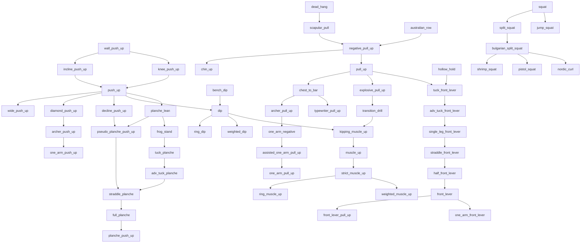

# DAG de progresiones — transiciones por nivel técnico

> **Scrapeo:** 2026-09-06. Cadenas de transición extraídas en vivo de
> [ampainsoc.org](https://ampainsoc.org) (front lever, muscle-up, push-up, pull-up, dip,
> pistol, squat) y [gmb.io](https://www.gmb.io/planche/) (planche). Los IDs (`push_up`,
> `tuck_front_lever`, `full_planche`…) coinciden con `barra/skills.py` para que el DAG
> encaje con lo que ya modela la app.

Este es un **grafo dirigido acíclico (DAG)**: cada nodo es un nivel técnico, cada arista es
una **transición** (requiere el nivel previo). Una arista `A → B` significa "para trabajar B
primero dominas A". Los niveles "medibles" (los 6 que barra puede verificar) están marcados
con ✔.

---

## Vista general (Mermaid)



---

## Front lever — transiciones (ejemplo que pediste)

```
hollow_hold ──┐
              ├─► tuck_front_lever ─► adv_tuck_front_lever ─► single_leg_front_lever ─► straddle_front_lever ─► half_front_lever ─► front_lever ─► { front_lever_pull_up, one_arm_front_lever }
pull_up ──────┘
```

| Nivel | ID (`skills.py`) | Transición desde | Rango del brazo | Cómo se reduce el lever |
|---|---|---|---|---|
| 1 | `tuck_front_lever` | pull_up + hollow_hold | más corto | rodillas al pecho |
| 2 | `adv_tuck_front_lever` | tuck_front_lever | medio | rodillas dobladas pero lejos del pecho |
| 3 | `single_leg_front_lever` | adv_tuck_front_lever | largo | una pierna extendida, una doblada |
| 4 | `straddle_front_lever` | single_leg_front_lever | largo | piernas en straddle |
| 5 | `half_front_lever` | straddle_front_lever | casi total | media-lay |
| 6 | `front_lever` | half_front_lever | total | cuerpo horizontal recto |
| 7 | `front_lever_pull_up` / `one_arm_front_lever` | front_lever | total | variantes de avance |

> Fuente scrapeada: ampainsoc `front-lever` — "Tuck → Advanced tuck → Single-leg → Straddle
> → full", con fundamento en **pull-up + inverted row**, y variantes dinámicas (front lever
> raise, ice cream maker). La app ya guarda esta cadena en `skills.py` (líneas 154–163).

---

## Planche — transiciones

```
push_up ─► planche_lean ─► frog_stand ─► tuck_planche ─► adv_tuck_planche ─► straddle_planche ─► full_planche ─► planche_push_up
                                            └─ pseudo_planche_push_up ──► straddle_planche
```

| Nivel | ID | Transición desde | Posición |
|---|---|---|---|
| 1 | `planche_lean` | push_up | inclinado sobre manos, hombros altos |
| 2 | `frog_stand` | planche_lean | rodillas en codos, peso en manos |
| 3 | `tuck_planche` | frog_stand | rodillas al pecho, brazos rectos |
| 4 | `adv_tuck_planche` | tuck_planche | rodillas dobladas lejos del pecho |
| 5 | `straddle_planche` | adv_tuck_planche + pseudo_planche_push_up | piernas abiertas |
| 6 | `full_planche` | straddle_planche | cuerpo recto horizontal |
| 7 | `planche_push_up` | full_planche | flexión sobre el planche |

> Fuente scrapeada: GMB `planche` — wrist prep → body positioning → tuck planche como primer
> hito; la cadena de niveles coincide con `skills.py` (líneas 175–182).

---

## Muscle-up — transiciones

```
pull_up ─► explosive_pull_up ─► transition_drill ─► kipping_muscle_up ─► muscle_up ─► strict_muscle_up ─► { ring_muscle_up, weighted_muscle_up }
dip ─────────────────────────► kipping_muscle_up
```

| Nivel | ID | Transición desde | Prerrequisito |
|---|---|---|---|
| 1 | `explosive_pull_up` | pull_up | 12+ pull-ups estrictos |
| 2 | `transition_drill` | explosive_pull_up | chest-to-bar |
| 3 | `kipping_muscle_up` | transition_drill + dip | 12+ dips estrictos |
| 4 | `muscle_up` | kipping_muscle_up | pull + dip + transición |
| 5 | `strict_muscle_up` | muscle_up | sin kipping |
| 6 | `ring_muscle_up` / `weighted_muscle_up` | strict_muscle_up | variantes |

> Fuente scrapeada: ampainsoc `muscle-up` — errores principales = subir poco (chin-to-bar),
> grip overhand, saltarse prerrequisitos (12+ pull-ups + 12+ dips), kipping, soltar el soporte.
> La cadena coincide con `skills.py` (líneas 124–137).

---

## Push — transiciones

```
wall_push_up ─► incline_push_up ─► push_up ─► { wide, diamond, decline } ─► archer ─► one_arm
wall_push_up ─► knee_push_up ──► push_up
decline ─► pseudo_planche_push_up
bench_dip ─► dip ─► { ring_dip, weighted_dip }
```

## Pull — transiciones

```
dead_hang ─► scapular_pull ─► negative_pull_up ─► { chin_up, pull_up } ─► chest_to_bar ─► { archer, typewriter } ─► one_arm_negative ─► assisted_one_arm ─► one_arm_pull_up
australian_row ─► negative_pull_up
```

## Squat — transiciones

```
squat ─► split_squat ─► bulgarian_split_squat ─► { shrimp_squat, pistol_squat, nordic_curl }
squat ─► jump_squat
```

---

## Nodos medibles por barra (✔)

Los 6 que la app puede verificar desde video (`MEASURED` en `skills.py`):
`push_up`, `dip`, `pull_up`, `muscle_up`, `knee_raise`, `squat`.

Los niveles de **front lever**, **planche**, **pistol_squat**, **toes_to_bar** y todos los
variantes (wide/diamond/archer/ring/weighted) son **mapa, no medición** — barra puede decir
si ganaste el intento, pero no puntuar el intento.

---

## Correspondencia con la app

- El `LADDER` de `progression.py` ya apunta de cada movimiento medible al siguiente hito
  (push_up→dip, dip→muscle_up, pull_up→muscle_up, squat→pistol_squat, knee_raise→toes_to_bar).
- Este DAG **amplía** ese ladder de un solo salto a la cadena completa de transiciones por
  nivel, para poder decir *en qué punto exacto de la cadena estás* y qué transición falta.
- Si se integra, cada nodo podría tener `standard` (reps × calidad × días) y `measurable`,
  igual que `skills.py`. La cadena de front lever/planche ya está; faltaría enlazar el
  `LADDER` para que el "next step" apunte al nodo concreto del DAG.

## Fuentes
- ampainsoc.org: `/front-lever/`, `/muscle-up/`, `/push-up/`, `/pull-up/`, `/dip/`,
  `/pistol-squat/`, `/squat/` (secciones "Common mistakes" y "Variations & progressions").
- gmb.io/planche: sección "Progressions" y "Common Obstacles".
